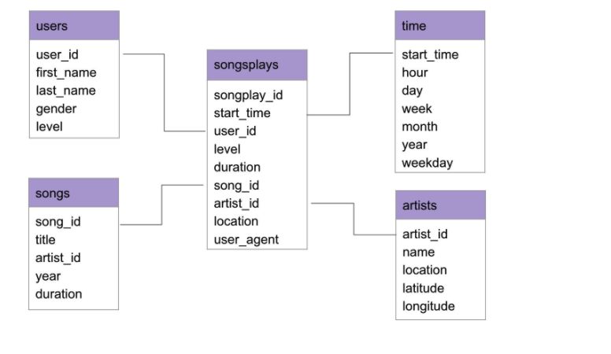

## Contents:
1. Project Summary
2. Data Modelling
3. Description of files
4. How to run?

# 1. Project Summary:

This project aims to power the analytics of song plays for a music streaming app, Sparkify.

Meta and log data are Extracted, transformed and loaded into a database following a star schema model centered around 
the facts regarding song plays.

## 2. Data Modelling :
### 2.1 Modelling process

Considering the song dataset we can divide the fields into two groups. One group of fields concern the artist. Namely, 
“artist_id”, “artist_location”, etc… The other group of fields concern the song. Namely, “song_id”, “duration”, etc…

Similarly, looking at the log data, we recognize other cateogries of info. Most importantly, in the timestamped logdata 
we can discern each song play (defined as a record with page = next). We also find data related to the session 
(session_id, itemsinSession, etc... ) and the users(e.g. userAgent, userId, etc...).

Each record for a songplay needs to be indexed with a new field called songplay_id which will serve as a primary key for
 our central fact table.

This fact table will contain foreign keys referencing primary keys in surrounding dimension tables. Based on our user 
requirements, session data will not be required. As for all other categories, this project includes the code to create 
the tables and the ETL pipelines powering storing them in a starschema.

### 2.2 Justification of facts table

We assume the user requirements include queries such as below:

1- find the user-id with most count of song plays.
2- find location with the most number of play
3- find the user_agent with the most number of plays 
4- find the time of the day with the most number of plays
5- find information about the paid songplays

We can see based on these queries, that facts such as the userAgent, location, level are important to run these 
analytics. We can see how this star schema allows for efficient analysis in the test.ipynb file provided in this project.

## 3. Description of Files:

### 3.1 Datasets:
The data directory includes two subdirectories containing the two datasets used in this project:

#### 3.1.1 The songs data 
Metadata about the song and the artist. The filename includes the track ID and the files are in the 
JSON format and are partitioned by the first three letters of each song's track ID. 
An example file is : data/song_data/A/B/C/TRABCEI128F424C983.json

#### 3.1.2 Logs Dataset
The second dataset represent logs of the events recorded in the app. Each event is timestamped.
An example file is : data/log_data/2018/11/2018-11-12-events.json

### 3.2 sql_queries.py
This file contains the sql queries to be used in creating the tables in the database (create_tables.py) and
inserting data into these tables (etl.py)

### 3.3 create_tables.py
This script creates the facts and dimension tables in the database.
 
### 3.4 etl.py
This script extracts data from the raw files, transforms it and loads the processed data into the tables.

### 3.5 test.ipynb
This script allows to run basic queries to confirm the implementation, as well as somme additional queries as examples 
of analysis.

 
 
## 4. How to run
The two following scripts should be run in order:
1. python create_tables.py
2. python etl.py
to test the implementation and run example queries, please run the jupyter notebook:
3. test.ipynb
